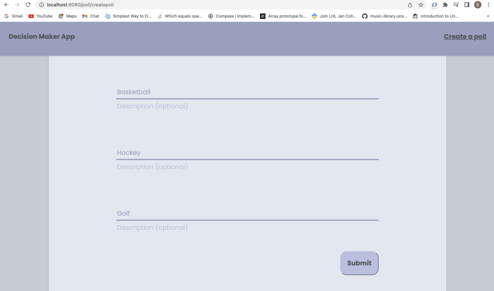
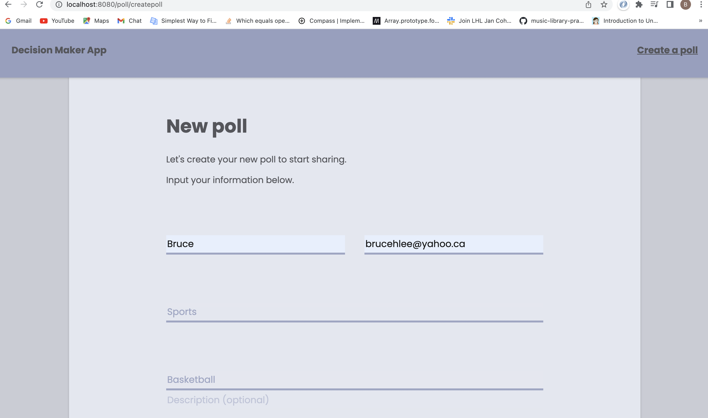
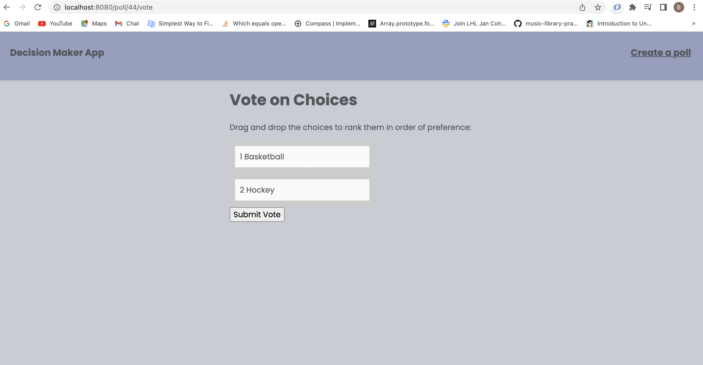
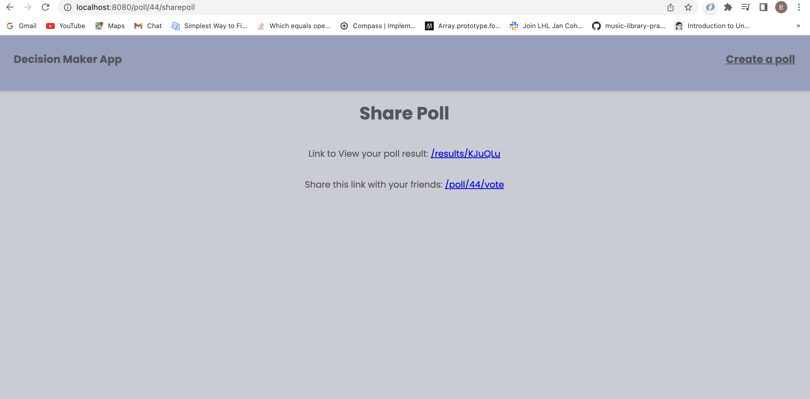
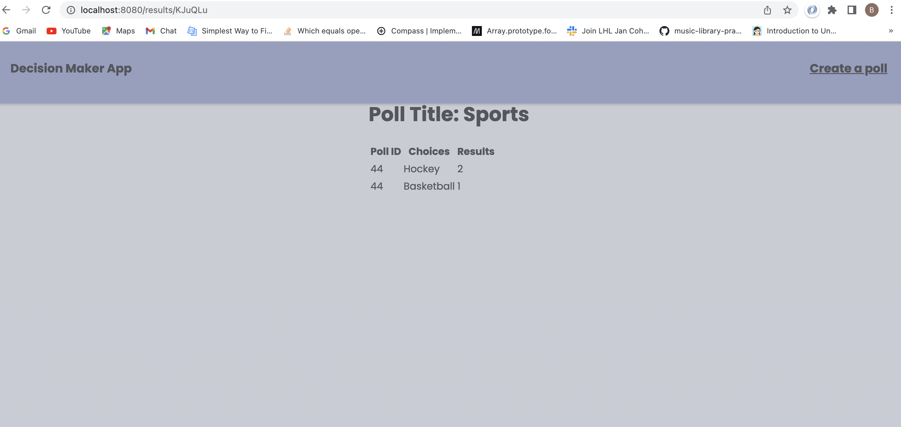
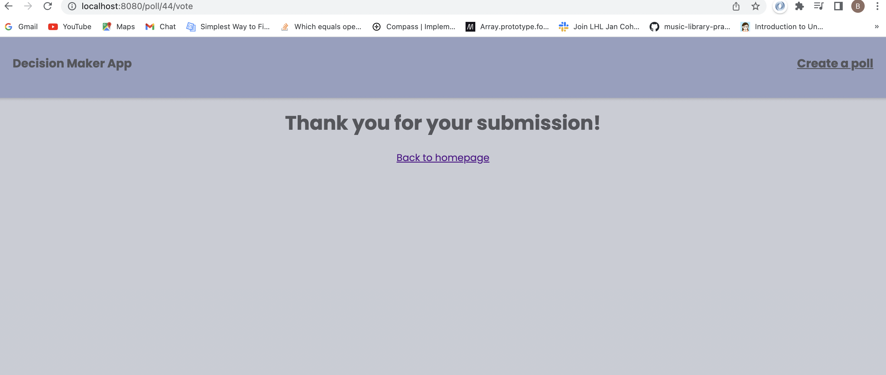
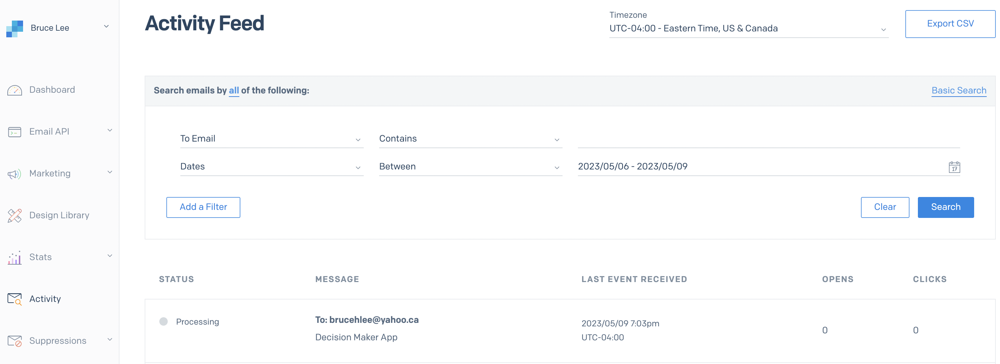
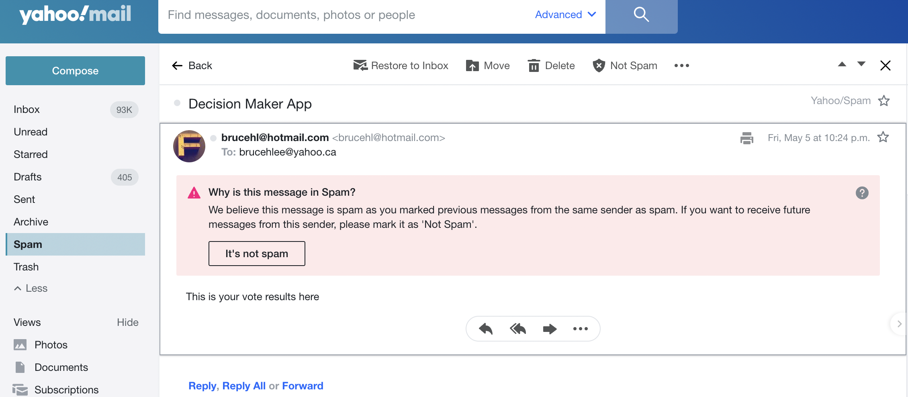

# Decision Maker App Midterm Project

The Decision Maker web app is designed to help groups of friends vote on preferred choices, such as which movie to watch. 

The app allows users to create a poll with multiple choices, each with a title and optional description, and requires the creator to enter an email. 

Once the poll is created, the user receives two links: an administrative link to access the results and a submission link to share with friends. 

Users who visit the submission link can rank the choices using drag and drop or another method, and then submit the poll. 

Each time a submission is received, the creator is notified via email (SendGrid Email System), which includes the administrative link and a link to the results. The app uses the Borda Count method to rank the results, and voters don't need to register or log in to participate.

## Final Product

# Screenshots

## SEND GRID API KEY 

The SEND GRID API KEY can be found in the .env file.

-Instead of using Mailgun, we integrated SendGrid, an online service that helps similarly with email delivery. 

-SendGrid is a widely used tool among developers to add email functionality to their applications.

-In the Decision Maker app, we used SendGrid to send important links and notifications to poll creators and participants. 

-The code uses a function called sendEmail to create the email message with the necessary parameters including the SendGrid API key, which then uses the SendGrid's sgMail.send() method and returns a Promise that resolves when the email is successfully sent,
or  rejects when an error occurs when sending out the message.  

-Overall, SendGrid provided us with reliable and efficient email notifications. 

## Getting Started - Using the LHL Node Skeleton

## Project Setup

The following steps are only for _one_ of the group members to perform.

1. Create your own copy of this repo using the `Use This Template` button, ideally using the name of your project. The repo should be marked Public
2. Verify that the skeleton code now shows up in your repo on GitHub, you should be automatically redirected
3. Clone your copy of the repo to your dev machine
4. Add your team members as collaborators to the project so that they can push to this repo
5. Let your team members know the repo URL so that they use the same repo (they should _not_ create a copy/fork of this repo since that will add additional workflow complexity to the project)

## Getting Started

1. Create the `.env` by using `.env.example` as a reference: `cp .env.example .env`
2. Update the .env file with your correct local information

- username: `labber`
- password: `labber`
- database: `midterm`

3. Install dependencies: `npm i`
4. Fix to binaries for sass: `npm rebuild node-sass`
5. Reset database: `npm run db:reset`

- Check the db folder to see what gets created and seeded in the SDB

7. Run the server: `npm run local`

- Note: nodemon is used, so you should not have to restart your server

8. Visit `http://localhost:8080/`

## Warnings & Tips

- Do not edit the `layout.css` file directly, it is auto-generated by `layout.scss`.
- Split routes into their own resource-based file names, as demonstrated with `users.js` and `widgets.js`.
- Split database schema (table definitions) and seeds (inserts) into separate files, one per table. See `db` folder for pre-populated examples.
- Use helper functions to run your SQL queries and clean up any data coming back from the database. See `db/queries` for pre-populated examples.
- Use the `npm run db:reset` command each time there is a change to the database schema or seeds.
  - It runs through each of the files, in order, and executes them against the database.
  - Note: you will lose all newly created (test) data each time this is run, since the schema files will tend to `DROP` the tables and recreate them.

## Dependencies

- Node 10.x or above
- NPM 5.x or above
- PG 6.x

